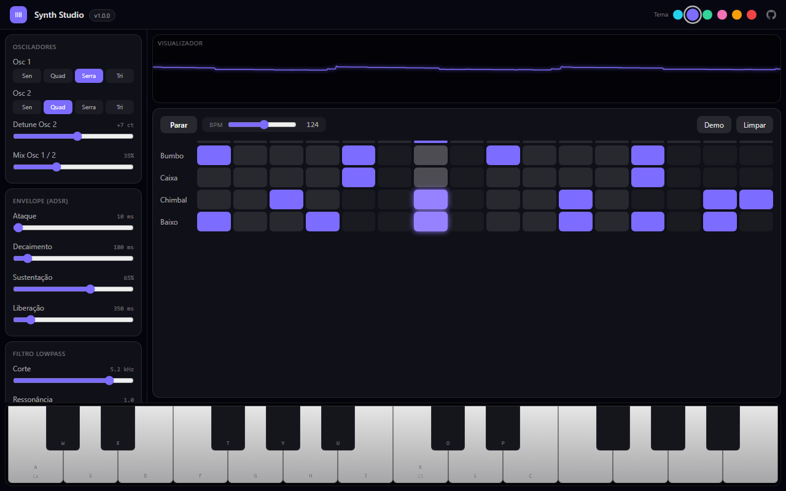
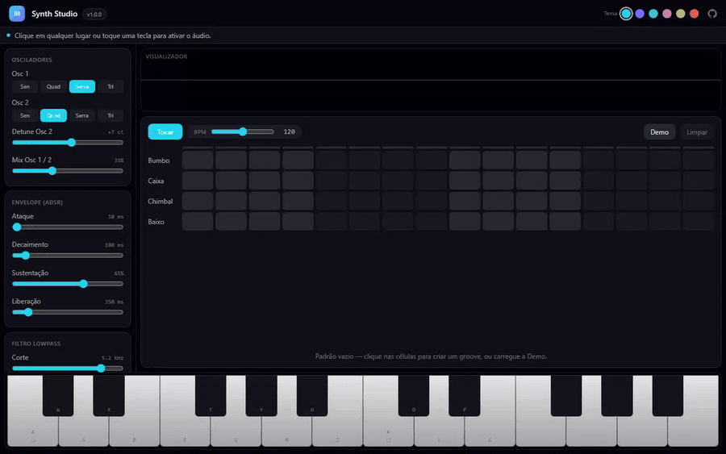

<div align="center">



# Synth Studio

**Sintetizador polifônico + sequenciador de bateria, 100% Web Audio — zero samples, zero bibliotecas de áudio.**

[](https://react.dev)
[](https://www.typescriptlang.org)
[](https://developer.mozilla.org/docs/Web/API/Web_Audio_API)
[](#)

[Como rodar](#rodando-localmente) · [Funcionalidades](#funcionalidades) · [Controles](#controles) · [Arquitetura](#arquitetura)

</div>

---

## O que é

Um estúdio musical completo no navegador. Todo o som é **sintetizado em tempo real** pela Web Audio API: as vozes do teclado nascem de osciladores com envelope ADSR, e a bateria do sequenciador (kick, snare, hi-hat) é gerada por osciladores e ruído filtrado — não existe um único sample de áudio no projeto.



## Funcionalidades

- **Sintetizador polifônico de 16 vozes** com roubo de voz (a nota mais antiga cede o lugar)
- **2 osciladores por voz** — formas de onda independentes (sine, square, sawtooth, triangle), detune de ±100 cents e mix
- **Envelope ADSR** completo (attack, decay, sustain, release) aplicado por automação de ganho
- **Filtro lowpass global** com cutoff em escala logarítmica (100 Hz – 12 kHz) e ressonância
- **Delay com feedback** (até 0,8 s / 85%)
- **Teclado de 2 oitavas** (C4–B5) tocável por mouse (com glissando) e pelo teclado físico
- **Sequenciador 16 passos × 4 trilhas** — kick, snare, hi-hat sintetizados + linha de baixo que usa o timbre do próprio synth
- **Agendamento com lookahead** (padrão Chris Wilson): timing de relógio de áudio, imune a jank da UI
- **Visualizador de forma de onda** em tempo real (AnalyserNode + canvas)
- **Padrão demo** pronto, BPM de 60 a 180, tema com 6 cores de destaque

## Rodando localmente

```bash
git clone https://github.com/leonardorejani/Synth-Studio.git
cd Synth-Studio
npm install
npm run dev     # http://localhost:5181
```

Clique em qualquer lugar para ativar o áudio (exigência dos navegadores), carregue a **Demo** e aperte **Tocar**.

## Controles

| Tecla física | Nota |
|---|---|
| A W S E D F T G Y H U J | C4 a B4 (brancas e pretas) |
| K O L P Ç … | C5 em diante |

Manual completo de parâmetros, mapeamento e **5 receitas de sound design** (baixo gordo, pad, pluck, lead, sino) em [docs/CONTROLES.md](docs/CONTROLES.md).

## Arquitetura

```
vozes (osc1 + osc2 → ADSR) ─┐
                            ├─→ filtro lowpass ─→ master ─┬─→ delay ⇄ feedback ─┐
bateria sintetizada ────────┘                             ├───────────────────────┴─→ analyser → limiter → saída
```

- `src/synth/engine.ts` — toda a engine de áudio: grafo de nós, vozes, percussão e o scheduler do sequenciador
- `src/synth/index.tsx` — orquestração de estado React ⇄ engine
- `Keyboard / Sequencer / Visualizer / controls` — componentes de UI puros

Mergulho técnico completo (grafo real, roubo de voz, síntese de cada peça da bateria, por que `setInterval` ingênuo não funciona para música) em [docs/ARQUITETURA.md](docs/ARQUITETURA.md).

## Origem

O Synth Studio nasceu como um dos 12 aplicativos do **[FableOS](https://github.com/leonardorejani/FableOS)** — um sistema operacional completo de navegador construído pelo Claude Fable 5 — e foi extraído como projeto independente.

---

<div align="center">

**Synth Studio 1.0.0** — projetado e construído pelo Claude Fable 5 · 2026

</div>
